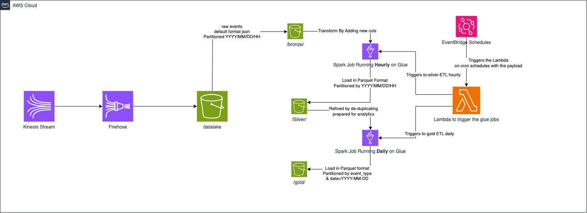

# Data Lake Challenge

This project is an implementation for the Data Lake Challenge, focusing on constructing a data lake from streaming events.

## Prerequisites

- [Python](https://www.python.org/downloads/) 3.9 or later
- [Terraform](https://learn.hashicorp.com/tutorials/terraform/install-cli)
- [AWS CLI](https://docs.aws.amazon.com/cli/latest/userguide/install-cliv2.html) and [configured](https://docs.aws.amazon.com/cli/latest/userguide/cli-chap-configure.html)
- [Docker](https://docs.docker.com/engine/install/) with at least 4GB of RAM and [Docker Compose](https://docs.docker.com/compose/install/) v1.27.0 or later
- [Localstack](https://docs.localstack.cloud/getting-started/installation/) needs the pro access (I recommend the trial subscription, free for the first 14 days, no billing information is required)

## Project Setup:

Using a preconfigured `Makefile` to run the project by steps

```
# Create virtual environment
$ python3 -m venv venv

# Activate virtual environment
$ source venv/bin/activate

# Install dependencies
$ pip3 install -r requirements.txt

# Start localstack to emulate AWS environment
$ make start

# Build the AWS infrastructure
$ make build
```

Once the stack is up running, you can access the localstack dashboard from [here](https://app.localstack.cloud/dashboard) to check the provisioned services.

To start the streaming of sample data, execute the following command:
```
# Stream sample data to kinesis
$ make stream
```


## Project Structure:

```
├── Makefile
├── README.md
├── docker-compose.yml
├── requirements.txt
├── apps
│   ├── __init__.py
│   ├── dummy_producer
│   │   └── produce.py
│   ├── glue_jobs
│   │   ├── __init__.py
│   │   └── data_lake_etl.py
│   └── lambda_jobs_trigger
│       ├── __init__.py
│       ├── trigger_job.py
│       └── trigger_job.zip
├── terraform
│   ├── modules
│   │   └── data-lake
│   │       ├── firehose.tf
│   │       ├── glue_data_catalog.tf
│   │       ├── glue_etls.tf
│   │       ├── kinesis_data_stream.tf
│   │       ├── lambda.tf
│   │       ├── provider.tf
│   │       ├── s3.tf
│   │       └── variables.tf
│   ├── production
│   │   ├── main.tf
│   │   ├── output.tf
│   │   ├── terraform.tfvars
│   │   └── variables.tf
│   └── staging
│       ├── main.tf
│       ├── terraform.tfstate
│       ├── terraform.tfvars
│       └── variables.tf
└── tests
    ├── __init__.py
    ├── test_data_lake_etl.py
    └── test_trigger_job.py
```

## Design Discussion

### Architecture Overview



The data lake architecture proposal implements the `medallion architecture` design pattern introduced by Databricks.

#### Descritpion:

The end-to-end architecture consists of an AWS Kinesis stream for real-time event data ingestion as the source, with a Firehose delivery stream application consuming from the stream.

Raw events received are forwarded to a `data lake S3 bucket`, in a sub-director constituting the `bronze layer`.

Data is stored partitioned by datetime till the hour level as follow `YYYY/MM/DD/HH` and in `JSON format` to bypass immediate data format transformation in Firehose, and prioritize cost efficiency over storage optimization.

Data transformations are applied while moving the data to the `silver layer` to make it refined and ready to be queried if necesserary.

In the silver layer data partitioned by datetime till the hour level like the bronze leyer and stored in `Parquet format` which is a columnar storage format optimized for analytics workloads. It offers advantages such as efficient compression and schema evolution support, making it well-suited for analytical queries, and ready to be queried by any SQL engine like Athena or Presto.

The `ETL process` from the bronze to the silver layer is a `Spark job` running on `AWS Glue`, triggered `hourly` by `AWS EventBridge` through a `Lambda` function. And this integration ensures scalability, and simplified management. And also the frequency comes as a good balance between avoiding the overhead / the cost of real-time processing and ensuring the data remains sufficiently up-to-date for analytical purposes.

Then the ETL process from the silver to the gold layer runs on the same way of Spark-Glue <-> Lambda <-> EventBridge, and triggered on a `daily` basis to keep a marge for heavy transformations like data `de-duplication` and `aggregation`.

Data in the gold layer is stored in Parquet format and partitioned by `event_type` and date of the following format `YYYY-MM-DD`, for easy querying per topic.

#### How would you ensure the architecture deployed can be replicable across environments?

To ensure replicability across environments, I've parameterized the data-lake module by `environment`, `aws_profile`, and `region`. This makes it to reproduce it in new environments, maintains consistency.

#### Would your proposed solution still be the same if the amount of events is 1000 times smaller or bigger?

For 1000 times larger events, I'd go for adjustments that would include scaling Kinesis shards to handle increased throughput and provisioning more workers with bigger machines for ETL processes to manage the higher data volume efficiently.

And 1000 times smaller, I'd opt for a lightweight approach, shifting from AWS Glue to a simpler solution like a Python application in a Docker container running on ECS or a Lambda function leveraging Python generators for optimal memory use.

#### Would your proposed solution still be the same if adding fields / transforming the data is no longer needed?

I would streamline my approach by removing the ETL processes. And then consequently, the bronze layer would function as the sole data lake, storing raw data without requiring any additional transformations or field additions.
